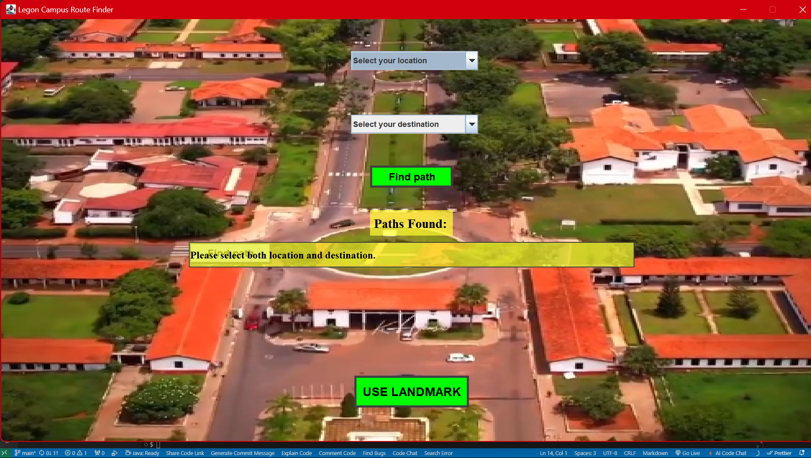

### DCIT 204 – Data Structures and Algorithms 1

# ||| OPTIMAL_ROUTE_SOLUTION_FOR_UNIVERSITY_OF_GHANA_CAMPUS |||

This Java application helps users find the shortest path between various locations on the University of Ghana campus. Using Dijkstra's algorithm and a Directed Graph (Digraph) data structure, the system provides an efficient navigation solution.

## Features

- **Location Selection**: Choose a starting location and destination from a dropdown list.
- **Shortest Path Calculation**: Calculate and display the shortest path between selected locations.
  h- **Landmark Navigation**: Option to use landmarks for navigation.

# IMAGES

